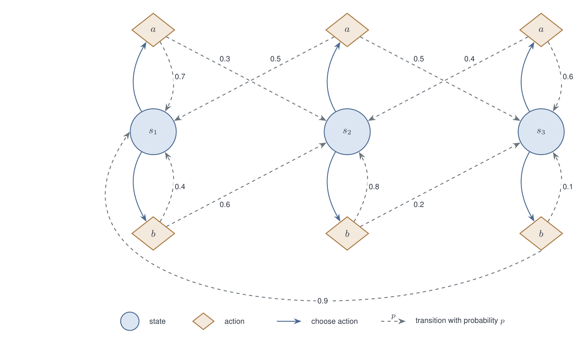

# tikz-diagram

A Claude Code agent that turns a plain-English description into a TikZ/LaTeX
drawing and a PNG you can drop into markdown. It is for the diagrams mermaid
cannot draw: nested trust zones and a system boundary, curved routes, several
edge styles with a legend, shapes like clouds, cylinders, and diamonds, exact
label placement, and a palette you control.

You describe the subject, not the drawing. The agent decides the layout,
writes the `.tex`, compiles it, rasterizes it, looks at the PNG, and fixes
what is wrong before handing back. You keep the `.tex` next to the markdown,
so the next change is a one-line request instead of a redraw.

## Requirements

- A LaTeX compiler with TikZ and the `standalone` class (`pdflatex`)
- A PDF-to-PNG rasterizer (`pdftoppm` from poppler; ImageMagick or
  Ghostscript also work)

Most machines have neither. The agent checks on every run, looks in the usual
install locations when a tool is not on PATH, falls back to Docker's
`texlive/texlive` image for compiling if Docker is running, and otherwise
returns the exact install commands for your platform. On macOS that is:

```
brew install --cask basictex
eval "$(/usr/libexec/path_helper)"
sudo tlmgr update --self
sudo tlmgr install standalone pgf
brew install poppler
```

Say "install whatever is needed" in your request and the agent runs the
non-sudo steps itself. Linux and Windows commands are in the agent file.

## Install

The agent is the single file [tikz-diagram.md](tikz-diagram.md). Copy it to
one of:

- `~/.claude/agents/tikz-diagram.md` to have it in every project, or
- `<repo>/.claude/agents/tikz-diagram.md` to ship it with one project.

Restart Claude Code (agents are discovered at session start).

## Use

Ask in any Claude Code session. Naming the agent guarantees the routing:

```
Use the tikz-diagram agent: <what you want drawn>
```

Output goes to `diagrams/` under the repo root, 2000 px wide, unless you say
otherwise.

## Example

This is the whole prompt. No sizes, no positions, no colours:

```
Use the tikz-diagram agent. Give me a Markov decision process diagram, 3
states, 2 actions per state, pick arbitrary transition probabilities. Use
circles for states and diamonds for actions.
```



Source: [examples/mdp.tex](examples/mdp.tex)

The agent chose the row layout with actions above and below each state, the
probabilities (each action's sum to 1), the two arrow styles, the route for
the one long transition under the row, and the legend. All of that is
listed in the report it returns.

## What comes back

```
diagram: mdp
tex: diagrams/mdp.tex
png: diagrams/mdp.png  (2009×1240 px)
markdown: 
choices: <the layout decisions the agent made, including the probability table>
defects: none
```

The `choices` list is worth reading once. It says what the agent decided on
your behalf, which is usually where you want to push back.

## Changing a diagram

Point Claude at the `.tex` and say what to change ("add a reward on each
transition", "make s3 terminal"). The agent edits the source, recompiles, and
re-checks the PNG.

## Layout of this repo

```
tikz-diagram.md   the agent: procedure, dependency handling, TikZ conventions, report format
examples/         the diagram above, .tex and .png
```
