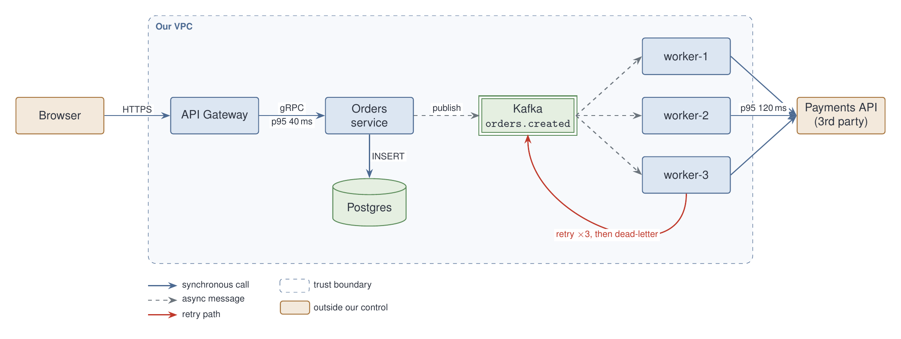
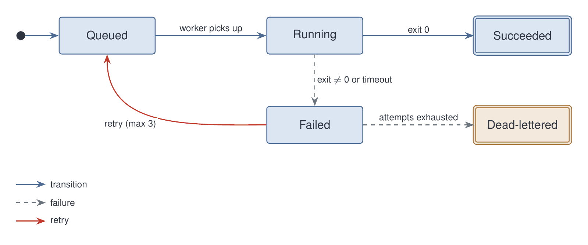

# tikz-diagram

A Claude Code agent that turns a plain-English description of a diagram into
a TikZ/LaTeX drawing and a PNG you can drop into markdown. It is for the cases
mermaid cannot handle: trust-boundary regions, curved routes, several arrow
styles with a legend, exact label placement, custom shapes, and a palette you
control.

The agent writes the `.tex`, compiles it, rasterizes it, looks at the PNG, and
fixes layout defects before handing back. You keep the `.tex` next to the
markdown, so the next change is a one-line prompt instead of a redraw.

## Requirements

- `pdflatex` (MacTeX or BasicTeX; `brew install --cask basictex`)
- `pdftoppm` (`brew install poppler`)

The agent checks for both and tells you what is missing.

## Install

The agent is the single file [tikz-diagram.md](tikz-diagram.md). Copy it to
one of:

- `~/.claude/agents/tikz-diagram.md` to have it in every project, or
- `<repo>/.claude/agents/tikz-diagram.md` to ship it with one project.

Restart Claude Code (agents are discovered at session start).

## Use

Ask in prose, in any Claude Code session:

```
Use the tikz-diagram agent: <description>
```

Plain "draw me a diagram of ..." also routes to it once installed, because the
agent's description tells Claude when to use it. Output defaults to
`diagrams/` under the repo root at 2000 px wide.

## Writing the description

Say where things go, how they connect, and what the line styles mean. The
agent takes the description literally and adds nothing except a legend when
three or more styles carry meaning. A good description covers:

- **Nodes and arrangement**: "left to right: A → B → C; D below B".
- **Edges and labels**: "A→B solid, labelled HTTPS; B→C dashed, labelled publish".
- **Regions**: "enclose B, C, D in a dashed rounded rectangle labelled Our VPC".
- **Special routes**: "a curved red arrow from D back to A labelled retry".
- **Shapes and emphasis**: "database as a cylinder", "terminal states double-bordered".
- **Colour code**: "services blue, stores green, third-party tan".

### Example 1 — order pipeline

```
Use the tikz-diagram agent. Draw our order pipeline, PNG about 2000 px wide,
output to diagrams/.

Layout, left to right: Browser → API Gateway → Orders service → Kafka topic
"orders.created" → three workers (worker-1..3, stacked vertically) → Payments API
(3rd party). Put a Postgres database (cylinder shape) directly below the Orders
service.

Enclose everything except the Browser and the Payments API in a dashed rounded
rectangle labelled "Our VPC" in the top-left corner, with a faint background tint.

Edge styles: synchronous calls are solid blue arrows, async messages are dashed
grey arrows. Label the sync edges HTTPS, gRPC, INSERT, and add p95 latencies on
Gateway→Orders (40 ms) and worker-2→Payments (120 ms). Label the async edge
Orders→Kafka "publish".

Add a red curved arrow from the bottom of worker-3 back to the bottom of Kafka,
labelled "retry ×3, then dead-letter".

Colour code: services light blue, data stores light green, third-party/external
boxes light tan. Sans-serif font, muted palette. Put a legend under the VPC box
for the three arrow styles, the trust boundary, and the "outside our control" fill.
```



Source: [examples/pipeline.tex](examples/pipeline.tex)

### Example 2 — job state machine

```
Use the tikz-diagram agent. Draw a state machine for a background job,
1600 px wide, output to diagrams/.

States, left to right: Queued → Running → Succeeded. Below Running put Failed.
Transitions: Queued→Running "worker picks up"; Running→Succeeded "exit 0";
Running→Failed "exit ≠ 0 or timeout"; Failed→Queued a curved red arrow labelled
"retry (max 3)"; Failed→Dead-lettered (a tan box to the right of Failed)
labelled "attempts exhausted". Succeeded and Dead-lettered are terminal: draw
them with a double border. Mark Queued as the initial state with a short arrow
from a filled dot on its left. Legend for the three arrow styles.
```



Source: [examples/job-states.tex](examples/job-states.tex)

## What comes back

```
diagram: order-pipeline
tex: diagrams/order-pipeline.tex
png: diagrams/order-pipeline.png  (2000×755 px)
markdown: 
choices: <layout decisions the description left open>
defects: none
```

## Changing a diagram

Point Claude at the `.tex` and describe the change ("move Postgres to the
right of Orders", "add a Redis cache between Gateway and Orders"). The agent
edits the source, recompiles, and re-checks the PNG.

## Layout of this repo

```
tikz-diagram.md   the agent: procedure, TikZ conventions, report format
examples/         the two diagrams above, .tex and .png
```
